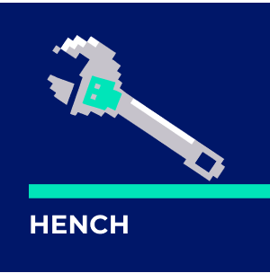

# Hench



Autonomous AI agent for executing [Rex](../rex) PRD tasks. Picks the next actionable task, builds a brief, runs a Claude tool-use loop, and records results.

## Quick Start

```sh
hench init .
hench run .
```

## Commands

### `hench init [dir]`

Create `.hench/` with default config and runs directory.

### `hench run [dir]`

Execute one task from the Rex PRD.

```sh
hench run .                    # run next task
hench run --task=<id> .        # run specific task
hench run --dry-run .          # print brief, no API calls
hench run --max-turns=20 .     # limit turns
hench run --model=<model> .    # override model
hench run --provider=cli .     # use Claude CLI instead of API
```

The agent loop:
1. Reads the Rex PRD and picks the next actionable task (or uses `--task`)
2. Assembles a task brief with parent chain, siblings, and project context
3. Runs a tool-use loop until the task is complete or turns are exhausted
4. Records the run with full metadata to `.hench/runs/`

### `hench status [dir]`

Show recent run history.

```sh
hench status .
hench status --last=20 .       # show more runs
hench status --format=json .
```

### `hench show <run-id> [dir]`

Display full details of a specific run including tool calls, token usage, and output.

## Configuration

`.hench/config.json`:

```json
{
  "schema": "hench/v1",
  "provider": "cli",
  "maxTurns": 50,
  "maxTokens": 8192,
  "rexDir": ".rex"
}
```

| Field | Default | Description |
|-------|---------|-------------|
| `provider` | `"cli"` | `"cli"` (Claude CLI) or `"api"` (Anthropic SDK) |
| `model` | — | Model override (omit to use provider default) |
| `maxTurns` | `50` | Maximum agent turns per run |
| `maxTokens` | `8192` | Max tokens per turn |
| `rexDir` | `".rex"` | Path to Rex directory |
| `apiKeyEnv` | `"ANTHROPIC_API_KEY"` | Env var for API key (api provider only) |

## Agent Tools

| Tool | Description |
|------|-------------|
| `read_file` | Read file contents |
| `write_file` | Write/create files |
| `list_directory` | List files and directories |
| `search_files` | Regex search across files |
| `run_command` | Execute shell commands |
| `git` | Run git operations |
| `rex_update_status` | Mark task in_progress/completed |
| `rex_append_log` | Log actions to Rex execution log |
| `rex_add_subtask` | Break down tasks into subtasks |

## Security

Hench enforces guardrails on the agent:
- **Blocked paths**: `.hench/`, `.rex/`, `.git/`, `node_modules/`
- **Allowed commands**: `npm`, `npx`, `node`, `git`, `tsc`, `vitest`
- **Command timeout**: 30 seconds
- **File size limit**: 1 MB

## Development

```sh
npm run build       # tsc
npm test            # vitest
npm run dev         # tsc --watch
```
